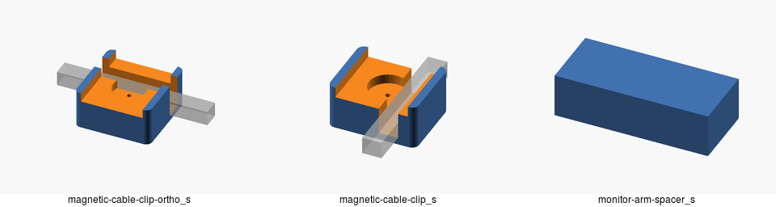

# misc-printable-accessories

<p align="center">
  
</p>

## Dependencies

- openscad (`2021.01`)
- [OskarLinde]'s [scad-utils](https://github.com/OskarLinde/scad-utils)

## Build

```sh
$ git submodule update --init --recursive # or git clone --recursive
$ make -j4
```
